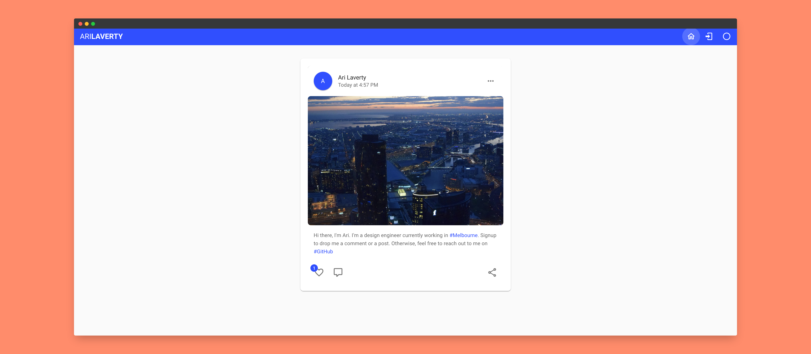

# arilaverty.dev
Live: http://arilaverty.dev

My personal site that demonstrates VueJS and integration with GCP services:
* Firestore
* Firebase Auth
* App Engine
* Cloud Run / Kubernetes

## Features
* Signup
* Login
* Password Reset
* Image Upload
* Post Commenting
* Post Sharing / Liking

## Deployment
* `app.yaml` can be sued to deploy to AppEngine
* Use the `Dockerfile` and `nginx.conf` for deployment to Cloud Run or Kubernetes as a container

## Project setup
```
yarn install
```

### Compiles and hot-reloads for development
```
yarn serve
```

### Compiles and minifies for production
```
yarn build
```

### Lints and fixes files
```
yarn lint
```

### Customize configuration
See [Configuration Reference](https://cli.vuejs.org/config/).
